# Hospital Management System

## 📌 Project Overview

**Hospital Management System** is a **console-based application** developed using the **C programming language**.  
It is designed to efficiently manage various hospital-related operations from a single interface.

The system provides the following core functionalities:

- **Patient Management:** Add, view, update, or delete patient information  
- **Doctor Management:** Store details about doctors and their specialties  
- **Emergency Services:** Manage emergency patients and ambulance services  
- **Appointment Scheduling:** Book or cancel patient appointments  
- **Billing System:** Generate and manage patient bills  
- **Pharmacy Management:** Add, view, update, or delete medicine information  
- **Staff Management:** Maintain records of hospital staff  

This project was developed as a practice tool for **structures, arrays, and menu-driven programming** in C.

---

## 🌟 Key Features

- **Menu-Driven Interface:** Simple and intuitive navigation using numbered options  
- **In-Memory Data:** All data is stored temporarily during program execution  
- **Modular Design:** Each hospital function is separated into manageable modules  
- **Emergency Case Handling:** Allows efficient response to emergency patients and ambulance availability  
- **Real-Life Simulation:** Mimics real hospital workflow with user input and logical output  

---

## 🚀 Installation & Running the Project

Follow these steps to set up and run the Hospital Management System:

### Step 1: Clone the Repository and Run the Project
Use the following commands in your terminal:

```bash
# Clone the repository
git clone https://github.com/farhananowshin2000/Hospitalmanagement.git

# Navigate to the project directory
cd Hospitalmanagement

# Compile the program
gcc main.c -o hospital

# Run the executable
./hospital
```
---

## Screenshots

### Login Screen
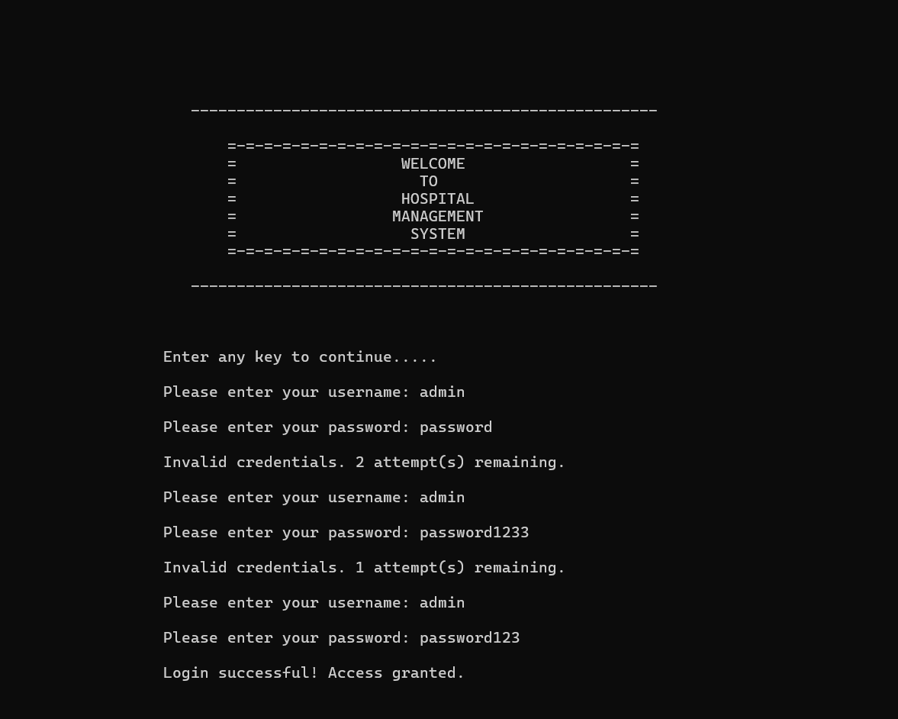

### Main Menu
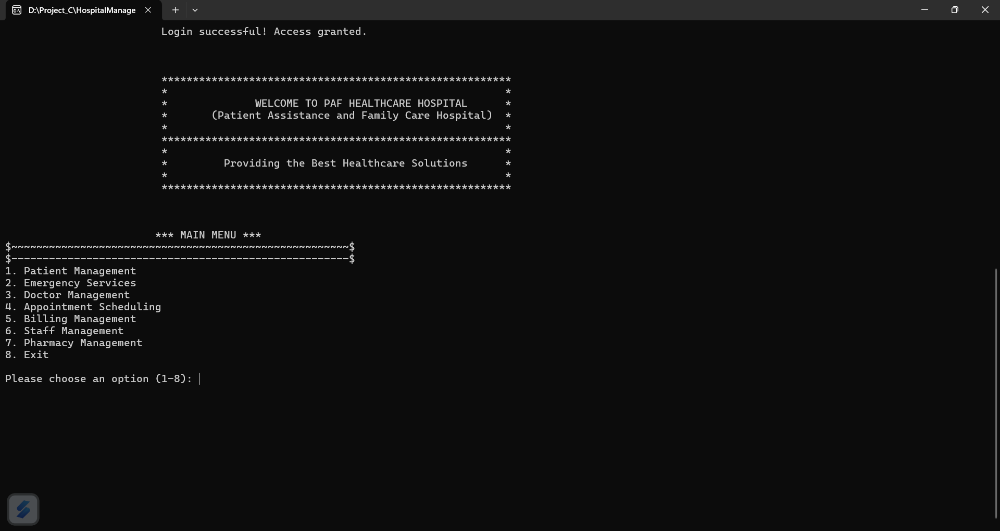

### Patient Management Menu 1
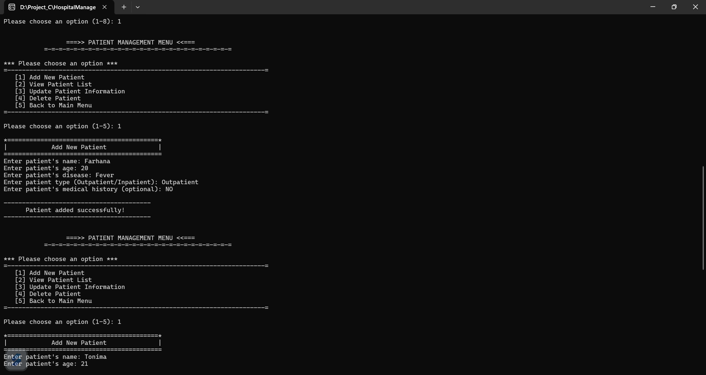

### Patient Management Menu 2
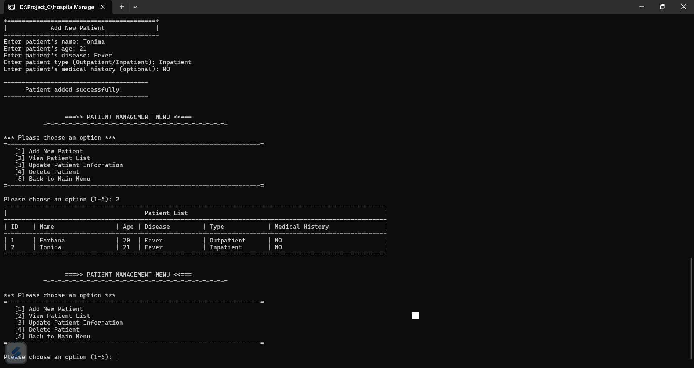

### Doctor Management Menu 1
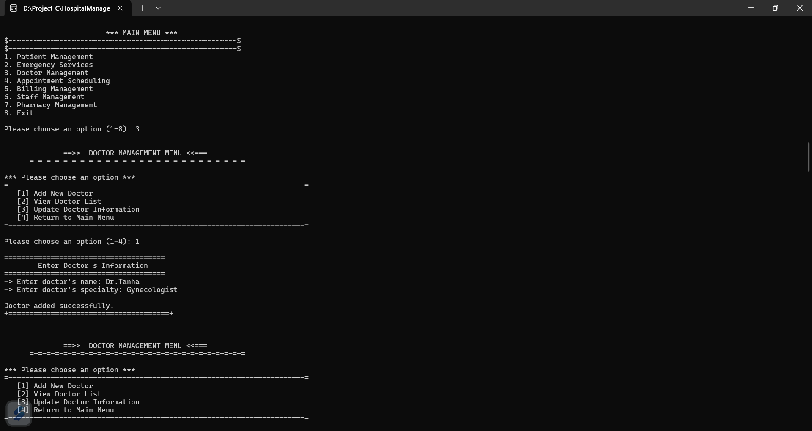

### Doctor Management Menu 2
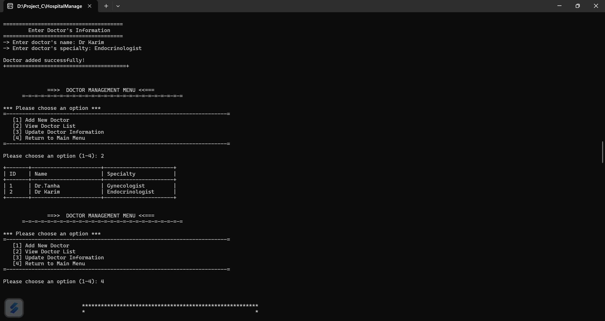

### Appointment Scheduling Menu 1
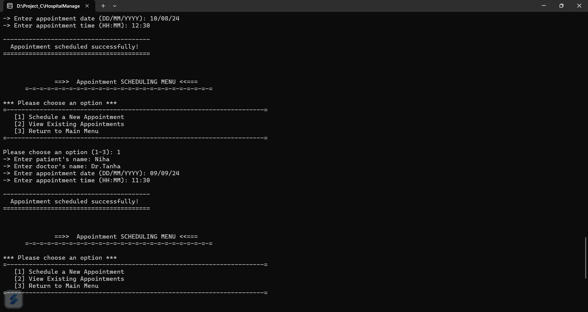

### Appointment Scheduling Menu 2
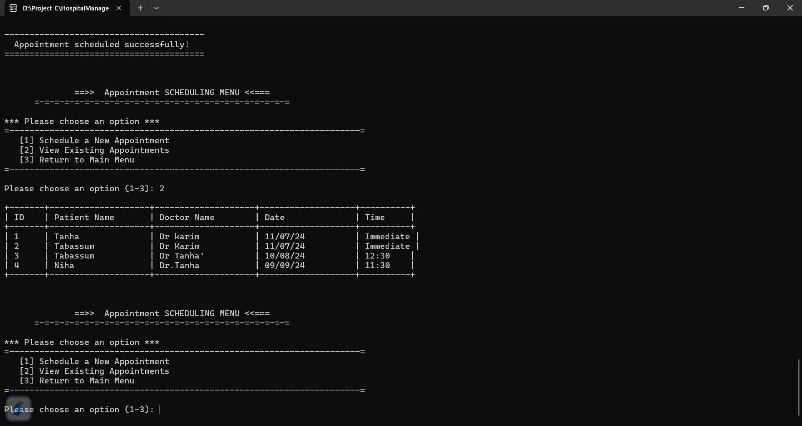

### Emergency Services Menu 1
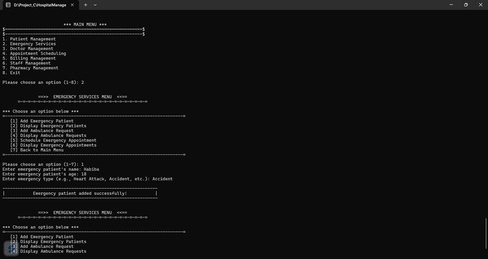

### Emergency Services Menu 2
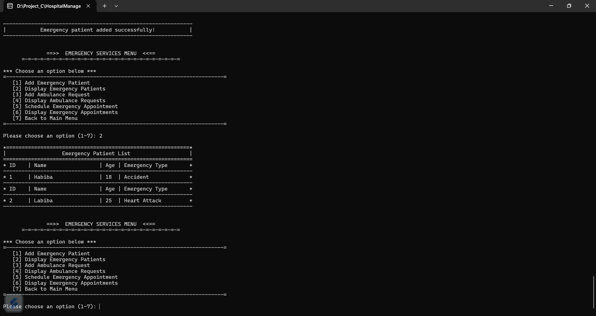

### Emergency Service Menu 3
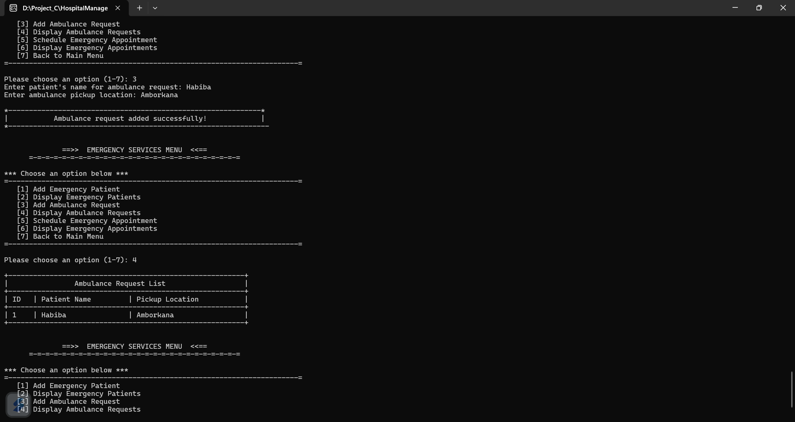

### Emergency Service Menu 4
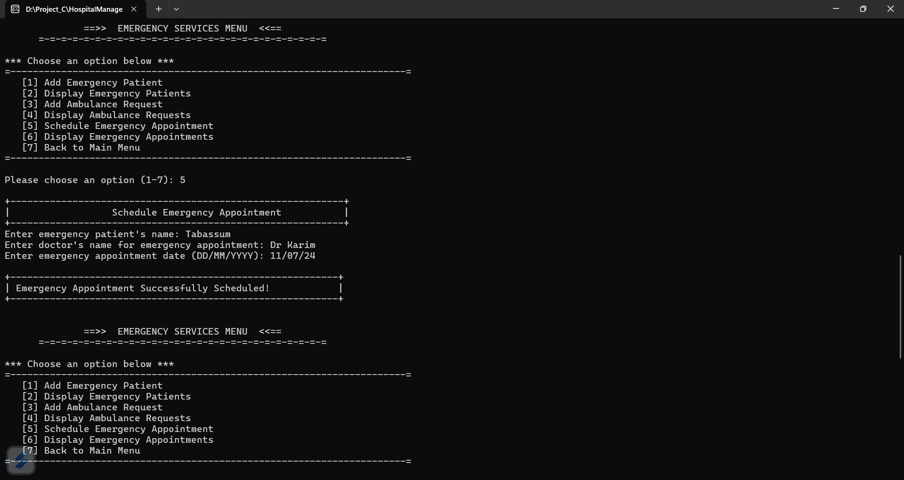

### Emergency Service Menu 5
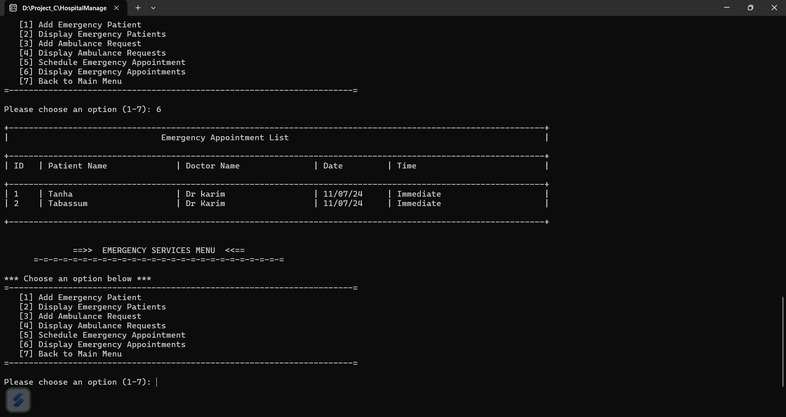

### Pharmacy Management Menu 1
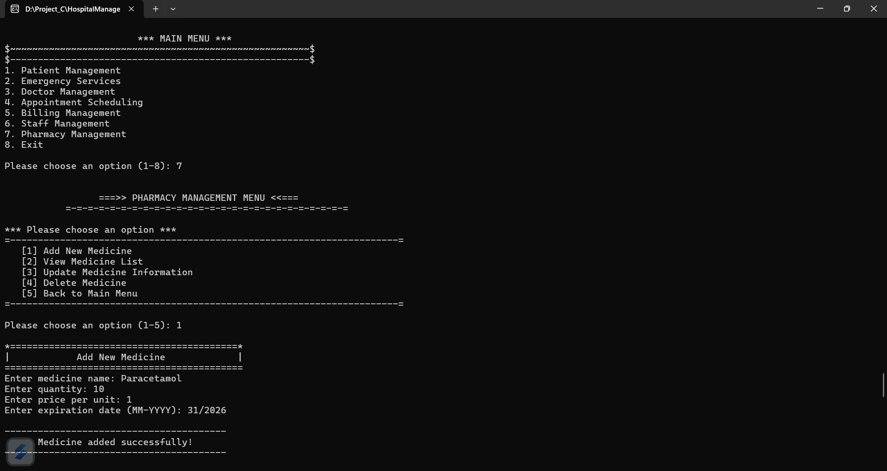

### Pharmacy Management Menu 2
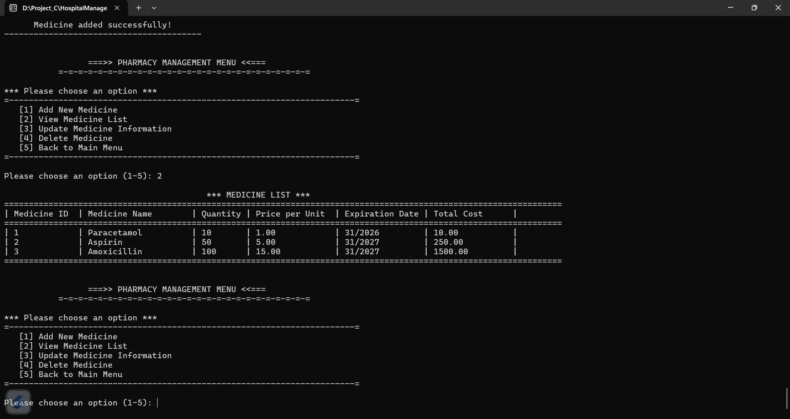

### Staff Management System 1
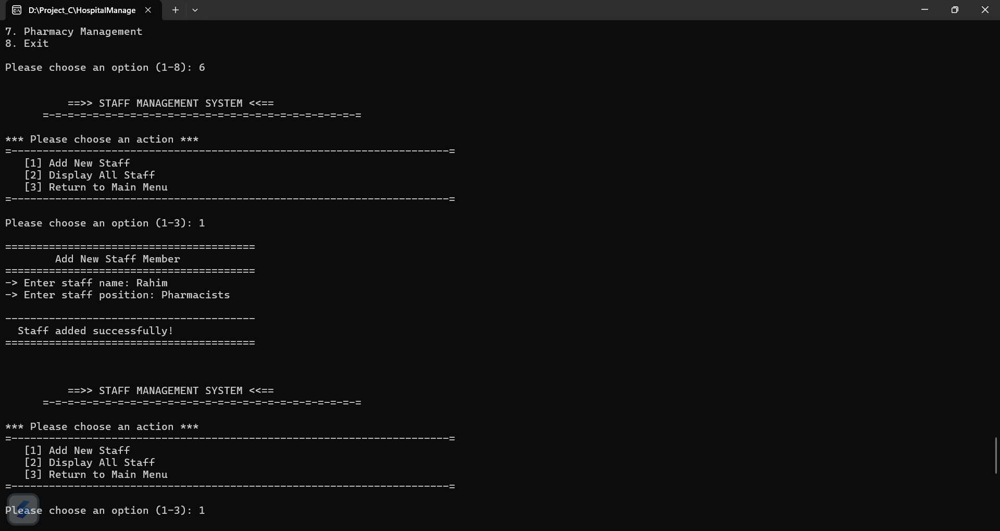

### Staff Management System 2
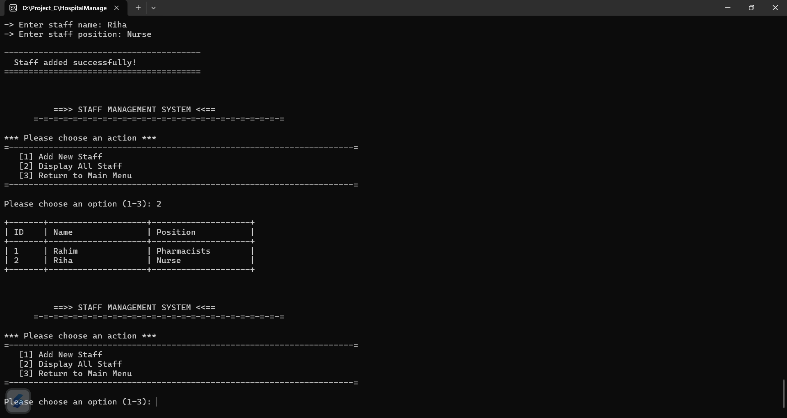

